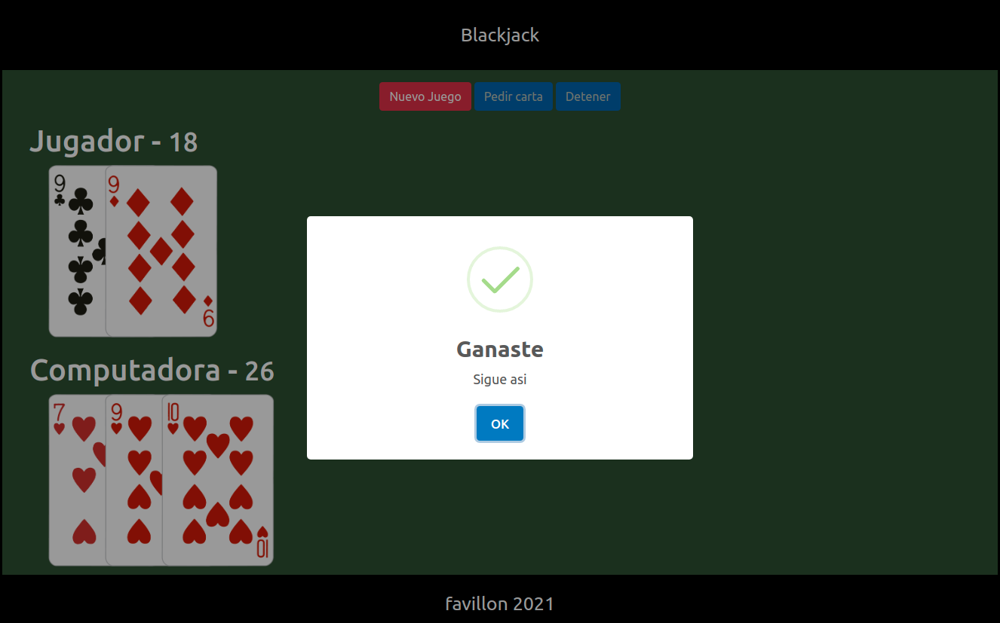

# Javascript Moderno

Ejecucion consola 

```shell
node ruta_file
```

* [Arrays](./01-fundamento/arreglos.js)
* [Objetos](./01-fundamento/objetosLiterales.js)
* [Funciones](./01-fundamento/functiones.js)
* [Valor o Referencia](./01-fundamento/valor-referencia.js)
* [Boolean](./01-fundamento/boolean.js)
* [Ciclos](./01-fundamento/ciclos.js)
* [Clases](./01-fundamento/classes/)


BlackJack

* [Juego Blackjack](./02-blackjack/)




Herramientas para minificar [minifier](https://javascript-minifier.com/)
