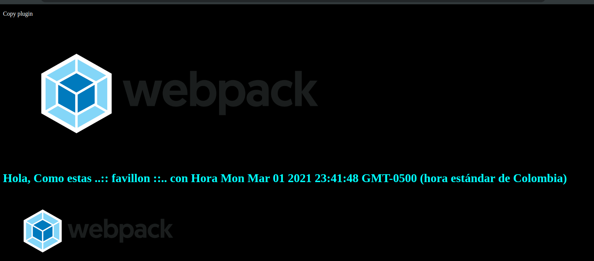

# Javascript Moderno


### Fundamentos
Ejecucion consola 

```shell
node ruta_file
```

* [Arrays](./01-fundamento/arreglos.js)
* [Objetos](./01-fundamento/objetosLiterales.js)
* [Funciones](./01-fundamento/functiones.js)
* [Valor o Referencia](./01-fundamento/valor-referencia.js)
* [Boolean](./01-fundamento/boolean.js)
* [Ciclos](./01-fundamento/ciclos.js)
* [Clases](./01-fundamento/classes/)


### BlackJack

* [Juego Blackjack](./02-blackjack/)


Herramientas para minificar [minifier](https://javascript-minifier.com/)


### Webpack

Inicializar package.json

```shell
npm init
```
Completamos la informacion solicitada por consola

```shell
npm init -y
```
Crea un package.json con valores por defecto 


Instalar webpack y su cliente
```shell
npm install webpack webpack-cli --save-dev
```
o
```shell
npm i webpack webpack-cli -D
```


Ejecutar webpack con configuracion basica

```shell
npm run build
```

Instalar paquetes para copiar el html index de src a dist y agregar el builder al html
```shell
npm i -D  html-loader html-webpack-plugin
```

Se configura el archivo `webpack.config.js` para la carga del html y la generacion del builder.js


Instalar servidor de webpack 
```shell
npm i -D webpack-dev-server
```

Ejecutar server de webpack con `npm run start:dev` 

Crear un archivo de estilos genericos , instalando el sigueiente paquete y configurando  el webpack

```shell
npm i -D mini-css-extract-plugin
```

Minificar el style generico, se instala el siguiente paquete
```shell
npm i -D optimize-css-assets-webpack-plugin@4.0.0
```

> solo en modo production se minifica las fuentes


Manejo de imagenes con webpack para carga dentro de los modulos

```shell
npm i -D file-loader 
```

Para la carga delos archivo estaticos sin modificacione se usa el plugin de copy
```shell
npm i -D copy-webpack-plugin
```

Se encargar de copiar de una ruta a a el dist


Se crea el archivo para la configuracion en PDN `webpack.prod.js`

Se Instala babel 
```shell
npm i -D babel-loader @babel/core
```

Ajustar reglas en webpack

Para minificar y traspilar de es6 aes5

```shell
npm i -D @babel/preset-env terser-webpack-plugin
```

Limpiar carpeta dist
```shell
npm i -D clean-webpack-plugin
```




##  Todo 

Proyecto lista de tareas

## Callbacks y Promesas


Ejemplos de callback y promesa que se ejecutan

```shell
node callback-promesas/file.js
```